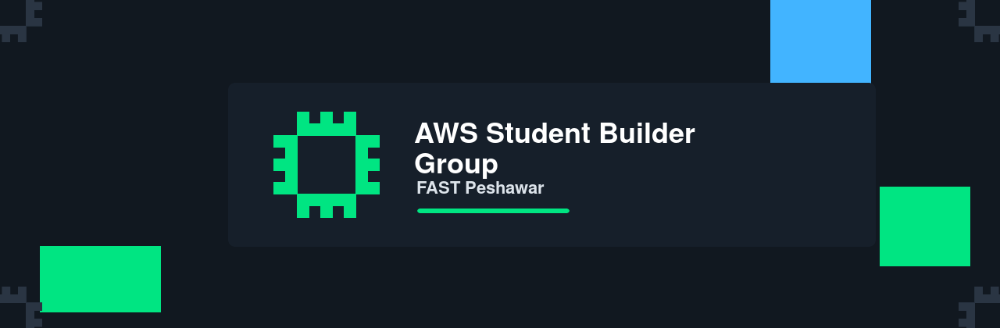

  

# AWS Student Builder Group FAST PWR

AWS Student Builder Group FAST PWR is a student-led builder community at FAST NUCES Peshawar focused on cloud, AI, developer tools, hands-on workshops, and peer learning.

Formerly AWS Cloud Club FAST PWR.

## What We Do

- Run hands-on cloud, AI, and developer workshops
- Share event resources, starter projects, and learning material
- Help students build, ship, and learn through community-led practice
- Support FAST Peshawar students preparing for cloud and builder careers

## Links

- LinkedIn: https://www.linkedin.com/company/awssbgfastpwr
- Instagram: https://www.instagram.com/awssbgfastpwr
- X/Twitter: https://x.com/awssbgfastpwr
- YouTube: https://www.youtube.com/@awssbgfastpwr
- Facebook: https://www.facebook.com/awssbgfastpwr

## Contact

For collaboration, workshops, and community partnerships:

awsccfast@pwr.nu.edu.pk
